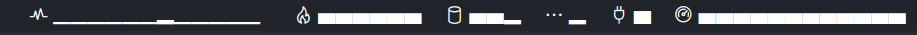
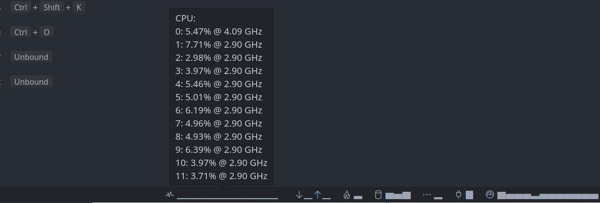
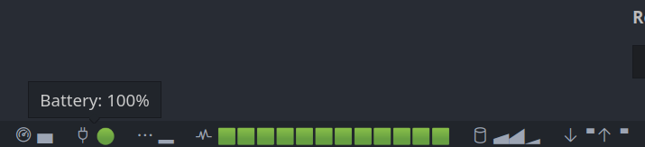

# Graphical Resource Monitor

## Features

Displays CPU frequency, usage, memory consumption, and battery percentage remaining within the VSCode status bar like the resmongraphical extension, but with graphical bars. It also adds tooltips to every resource to get detailed information about each. Addtionally, it can display every statistics about every cpu core individually.

## Screenshots

## Requirements

The system information node module.

## Extension Settings

### Visibility settings
- `resmongraphical.cpuusage.show`: Toggles the display of CPU Usage. In Windows, this percentage is calculated with processor time, which doesn't quite match the task manager figure.
- `resmongraphical.cpuusage.show.allcpus`: Toggles the display of CPU usage for all cores. Default is true.
- `resmongraphical.cpufreq.show`: Toggles the display of CPU frequency. For Windows, this displays the maximum clock speed.
- `resmongraphical.cpufreq.show.allcpus`: Toggles the display of CPU frequency for all cores. Default is true.
- `resmongraphical.mem.show`: Toggles the display of memory consumption.
- `resmongraphical.battery.show`: Toggles the display of battery percentage remaining if a device with a battery. If the device reports not having a battery, this setting will always be treated as false.
- `resmongraphical.disk.show`: Toggles the display of disk space information.
- `resmongraphical.cputemp.show`: Toggles the display of CPU temperature. May not work without the lm-sensors module on Linux. May require running VS Code as admin on Windows.
- `resmongraphical.cputemp.show.allcpus`: Toggles the display of CPU temperature for all cores. Default is true.
- `resmongraphical.net.show`: Show network statistics.

### Color settings
For each of the colors, if none is specified the default theme will be used. The format for each color must be hexidecimal #RRGGBB, where ##FF000 is red, #00FF00 is green, and #00000FF is blue.

- `resmongraphical.cpuusage.color`: Color for CPU usage.
- `resmongraphical.cpufreq.color`: Color for CPU frequency.
- `resmongraphical.mem.color`: Color for memory usage.
- `resmongraphical.battery.color`: Color for battery percentage.
- `resmongraphical.disk.color`: Color for disk usage.
- `resmongraphical.cputemp.color`: Color for CPU temperature.
- `resmongraphical.net.color`: Color for network statistics.

### Style settings
- For each of the settings.style the following can be applied:
  - `Vertical` - Vertical bars. If no option.style is specified, this is the default.
  - `Horizontal`- Horizontal bars.
  - `CirclePie` - Circular pie graph.
  - `squarePie` - Square pie graph.
  - `VerticalMeter` - Vertical meter line.
  - `HorizontalMeter` - Horizontal meter line.
  - `Dots` - Vertical bars made up of dots.
  - `Geo` - Square geometric shape.
  - `Shade` - A shaded bar.
  - `SquareColor` - 'A square color that goes from green to red. Color settings will not apply to this.
  - `CircleColor` - A circular color that goes from green to red. Color settings will not apply to this.
  - `InverseSquareColor` - 'A square color that goes from red to green. Color settings will not apply to this.
  - `InverseCircleColor` - A circular color that goes from red to green. Color settings will not apply to this.
- `resmongraphical.cpuusage.style`: Style for CPU usage.
- `resmongraphical.cpufreq.style`: Style for CPU frequency.
- `resmongraphical.mem.style`: Style for memory usage.
- `resmongraphical.battery.style`: Style for battery percentage.
- `resmongraphical.disk.style`: Style for disk usage.
- `resmongraphical.cputemp.style`: Style for CPU temperature.
- `resmongraphical.net.style`: Style for network statistics.

### Other settings
- `resmongraphical.disk.format`: Configures how the disk space is displayed. Options are:
  - `PercentUsed`
  - `PercentRemaining`
  - `Remaining`
  - `UsedOutOfTotal`
- `resmongraphical.disk.drives`: Drives to show. For example, 'C:' on Windows, and '/dev/sda1' on Linux.
- `resmongraphical.net.ifaces`: Network interfaces to show. For example `eth0`.
- `resmongraphical.updatefrequencyms`: How frequently to query systeminformation. The minimum is 4000 ms as to prevent accidentally updating so fast as to freeze up your machine.
- `resmongraphical.freq.unit`: Unit used for the CPU frequency (GHz-Hz). Options are:
  - `GHz` - Gigahertz.
  - `MHz` - Megahertz.
  - `KHz` - Kilohertz.
  - `Hz` - Hertz.
- `resmongraphical.mem.unit`: Unit used for the RAM consumption (GB-B). Options are:
  - `GB` - Gigabytes.
  - `MB` - Megabytes.
  - `KB` - Kilobytes.
  - `B` - Bytes.
- `resmongraphical.net.unit`: Unit used for the network statistics (Gbs-Kbs). Options are:
  - `Gbps` - Gigabits per second.
  - `Mbps` - Megabits per second.
  - `Kbps` - Kilobits per second.
  - `Bps` - Bits per second.
- `resmongraphical.alignLeft`: Toggles the alignment of the status bar.
- `resmongraphical.precision`: The floating point precision to display in each resource.

## Known Issues

Tooltips disappear if they change. This is a known vscode bug: https://github.com/microsoft/vscode/issues/128887

---

## Change Log

### [1.0.0]
- Forked resmon and added stats about individual cpu cores, added ability to change color and per.style resource, and added implementation for network stats.

